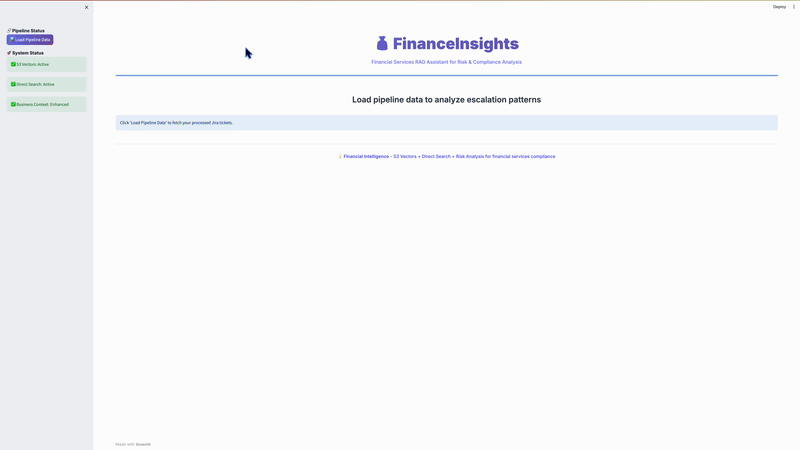

# FinanceInsights - Jira RAG Assistant

**Authors:** Shashi Makkapati, Senthil Kamala Rathinam, Jacob Scheatzle

This sample demonstrates how to build a Retrieval-Augmented Generation (RAG) application for financial services that analyzes Jira tickets using Amazon Bedrock, S3 Vector Engine, and AI-powered insights for risk management and compliance analysis.

## Overview

FinanceInsights helps financial services organizations analyze support tickets using natural language queries. The application leverages AWS services to provide intelligent insights into compliance risks, fraud patterns, and operational issues.



*Demo: Complete setup and usage workflow - from initial configuration to AI-powered financial risk analysis*

### Key Features

- **Smart Setup**: Demo mode or your own Jira tickets
- **Hybrid Search**: S3 Vector Engine with semantic search fallback
- **Natural Language Queries**: Ask questions in plain English
- **AI-Powered Analysis**: Amazon Bedrock for embeddings and insights
- **Financial Risk Intelligence**: Compliance, fraud, and regulatory analysis
- **Modern UI**: Professional Streamlit interface

## Architecture

```
Data Source → S3 Storage → S3 Vector Engine → Bedrock AI → Streamlit UI
```

## Prerequisites

- AWS Account with Bedrock access (us-east-1 region)
- Python 3.8+
- AWS CLI configured with appropriate permissions
- Jira Cloud account (free tier works)

### Setting up Jira with Sample Tickets

If you don't have Jira tickets, create a free Jira account and populate it with sample data:

1. **Create Jira account**: [Sign up at Atlassian](https://www.atlassian.com/software/jira/free)
2. **Get API credentials**: Account Settings → Security → API Tokens
3. **Generate sample tickets**:
   ```bash
   # After configuring .env with your Jira credentials
   python3 source/utils/jira_bulk_loader.py
   ```
   This creates 100+ realistic financial services tickets in your Jira instance.

### AWS Services Used

- **Amazon Bedrock**: Titan embeddings + Claude for analysis
- **S3 Vector Engine**: Serverless vector search (**Preview** - requires access)
- **Amazon S3**: Data storage and vector storage

> **Note**: S3 Vector Engine is currently in preview. You may need to request access through AWS Support or your AWS account team.

## Getting Started

### Installation

1. **Clone and install**
```bash
git clone https://github.com/AWS-Samples-GenAI-FSI/FinanceInsights-Jira-Bedrock-S3-Vectors.git
cd FinanceInsights-Jira-Bedrock-S3-Vectors
pip install -r requirements.txt
```

2. **Configure environment**
```bash
cp .env.example .env
```

Edit `.env`:
```env
AWS_REGION=us-east-1

# Jira Configuration
JIRA_URL=https://yourcompany.atlassian.net
JIRA_EMAIL=your-email@company.com
JIRA_API_TOKEN=your-jira-api-token
```

3. **Launch application**
```bash
streamlit run source/streamlit/main_app.py
```

## Configuration

### Customizing for Your Organization
Edit `source/config/financial_context.json`:

```json
{
  "app_name": "YourCompany Insights",
  "critical_systems": ["Payment processing", "Trading platforms"],
  "risk_indicators": ["fraud", "compliance", "regulatory"]
}
```

## Advanced Features

### Business Intelligence
- **Urgency Scoring**: 1-10 based on regulatory/customer impact
- **Risk Assessment**: Compliance, fraud, and operational risk analysis
- **Escalation Patterns**: Automatic priority classification

### Using Your Own Jira Data
To use your Jira tickets instead of demo data:
1. Get Jira API token: Account Settings → Security → API Tokens
2. Add credentials to `.env` file
3. Choose "Use Your Jira Tickets" during setup

## Troubleshooting

### Common Issues

**Bedrock Access**: Request access to Titan and Claude models in AWS Console
**S3 Vector Engine**: Service is in preview - request access if needed
**Setup Fails**: Try demo mode first to verify AWS configuration

```bash
# Verify AWS setup
aws sts get-caller-identity
aws bedrock list-foundation-models --region us-east-1
```

## Cleanup

Remove all AWS resources:
```bash
python3 deployment/cleanup.py
```

## Use Cases

### Industry Applications
- **Banks**: Compliance monitoring, fraud detection
- **Fintech**: Payment system monitoring, regulatory tracking
- **Trading Firms**: Market risk analysis, system monitoring
- **Insurance**: Claims processing, compliance

## Contributing

See [CONTRIBUTING](CONTRIBUTING.md) for more information.

## Security

See [CONTRIBUTING](CONTRIBUTING.md#security-issue-notifications) for more information.

## License

This library is licensed under the Apache License 2.0. See the LICENSE file.